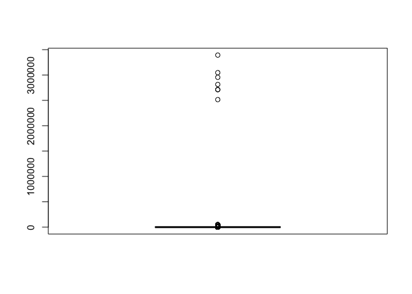
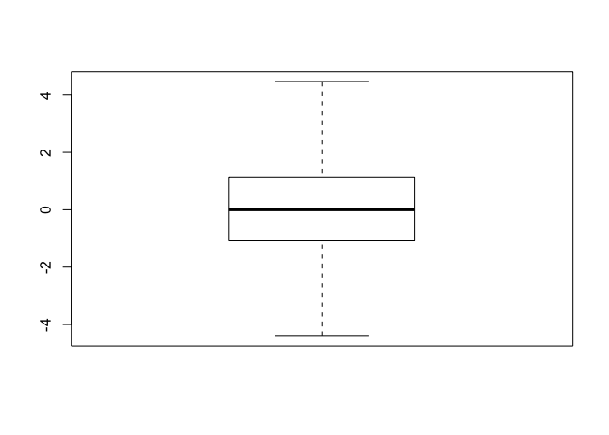
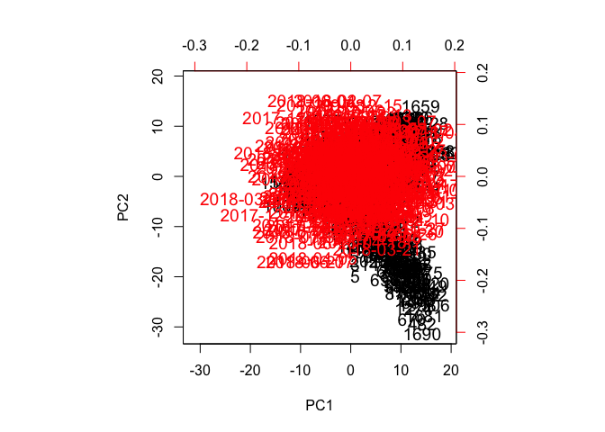
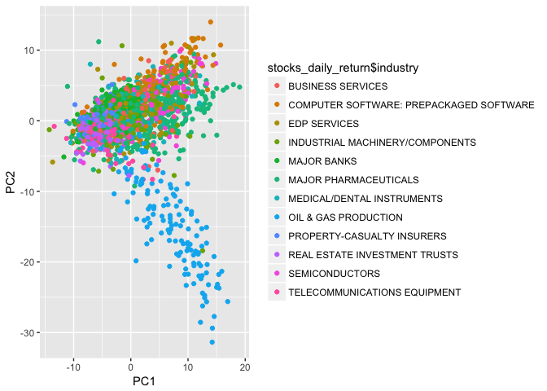
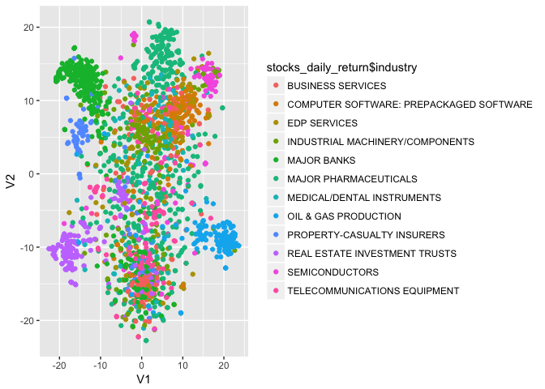
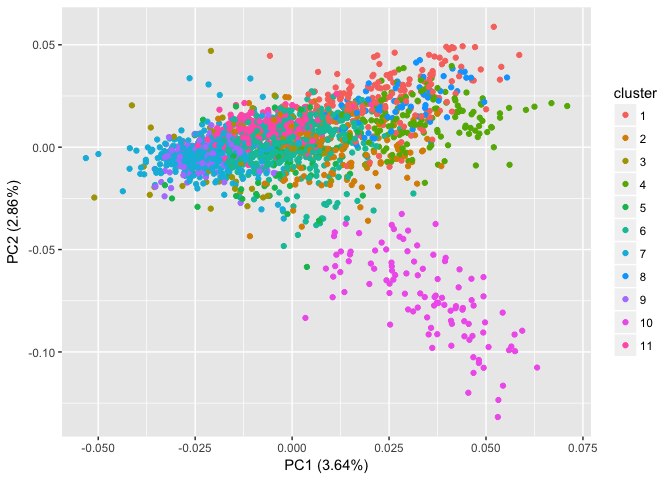
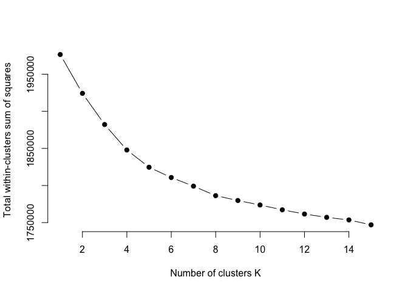
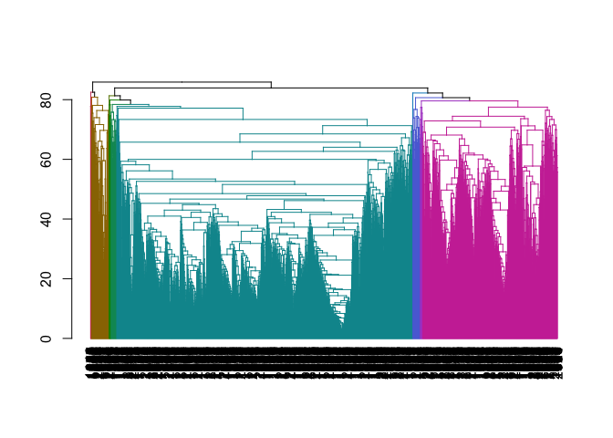

Introduction
------------

In this work, we will apply Principal Component Analysis (PCA), t-Distributed Stochastic Neighbor Embedding (TSNE), K-means clustering and Hierarchical clustering. We will construct our dataset using the two datasets that can be obtained here: <https://www.kaggle.com/ehallmar/daily-historical-stock-prices-1970-2018>. The two datasets that we use as our source, have daily stock prices for a selection of several thousand stock tickers from NYSE and NASDAQ. The dataset we will work on covers the dates between '2017-08-24' AND '2018-08-24' and the 11 industries with the most number of observations. Our aim is to cluster the records so that the companies in the same industry will be grouped together.

Exploring the Dataset
---------------------

As mentioned earlier, we will use two datasets as our source. Both are very large in size so we will use `data.table` to increase reading speed. The first dataset is `historical_stock_prices.csv` and the second one is `historical_stocks.csv`. The first and the second datsets have `ticker` in common. While constructing our data, we will need features from both sets. Just a note, we will use `SQL` for table manipulation.

The first dataset mostly has numerical variables as follows:

``` r
library(data.table) #for big data
```

    ## Warning: package 'data.table' was built under R version 3.5.2

``` r
historical_stock_prices<-as.data.frame(fread("historical_stock_prices.csv")) #the table is changed to data frame
head(historical_stock_prices)
```

    ##   ticker  open close adj_close   low  high  volume       date
    ## 1    AHH 11.50 11.58  8.493155 11.25 11.68 4633900 2013-05-08
    ## 2    AHH 11.66 11.55  8.471151 11.50 11.66  275800 2013-05-09
    ## 3    AHH 11.55 11.60  8.507822 11.50 11.60  277100 2013-05-10
    ## 4    AHH 11.63 11.65  8.544494 11.55 11.65  147400 2013-05-13
    ## 5    AHH 11.60 11.53  8.456484 11.50 11.60  184100 2013-05-14
    ## 6    AHH 11.60 11.60  8.507822 11.54 11.60   76800 2013-05-15

The second data set has categorical data as follows:

``` r
historical_stocks<-as.data.frame(fread("historical_stocks.csv"))
head(historical_stocks)
```

    ##   ticker exchange                                   name            sector
    ## 1    PIH   NASDAQ 1347 PROPERTY INSURANCE HOLDINGS, INC.           FINANCE
    ## 2  PIHPP   NASDAQ 1347 PROPERTY INSURANCE HOLDINGS, INC.           FINANCE
    ## 3   TURN   NASDAQ               180 DEGREE CAPITAL CORP.           FINANCE
    ## 4   FLWS   NASDAQ                1-800 FLOWERS.COM, INC. CONSUMER SERVICES
    ## 5   FCCY   NASDAQ          1ST CONSTITUTION BANCORP (NJ)           FINANCE
    ## 6   SRCE   NASDAQ                 1ST SOURCE CORPORATION           FINANCE
    ##                     industry
    ## 1 PROPERTY-CASUALTY INSURERS
    ## 2 PROPERTY-CASUALTY INSURERS
    ## 3 FINANCE/INVESTORS SERVICES
    ## 4     OTHER SPECIALTY STORES
    ## 5       SAVINGS INSTITUTIONS
    ## 6                MAJOR BANKS

As we mentioned earlier, we are going to use `SQL` in `r`. To do this, we need the library `sqldf`. We need to inner join these two datasets and will select the features we need. Note that both datasets have `ticker` in common.

``` r
library(sqldf)
```

    ## Loading required package: gsubfn

    ## Loading required package: proto

    ## Warning in doTryCatch(return(expr), name, parentenv, handler): unable to load shared object '/Library/Frameworks/R.framework/Resources/modules//R_X11.so':
    ##   dlopen(/Library/Frameworks/R.framework/Resources/modules//R_X11.so, 6): Library not loaded: /opt/X11/lib/libfontconfig.1.dylib
    ##   Referenced from: /Library/Frameworks/R.framework/Resources/modules//R_X11.so
    ##   Reason: Incompatible library version: R_X11.so requires version 11.0.0 or later, but libfontconfig.1.dylib provides version 10.0.0

    ## Could not load tcltk.  Will use slower R code instead.

    ## Loading required package: RSQLite

    ## Warning: package 'RSQLite' was built under R version 3.5.2

``` r
stocks<-sqldf("SELECT open, date,hsp.ticker, hs.industry
               FROM historical_stock_prices AS hsp
               INNER JOIN historical_stocks AS hs
               ON hsp.ticker=hs.ticker  
      ")
```

Now we are interested in the observations of `stocks` that are between '2017-08-24' and '2018-08-24'. In the below code, we construct the dataset `stocks_2018`.

``` r
stocks_2018<-sqldf("SELECT *
                    FROM stocks
                    WHERE date BETWEEN '2017-08-24' AND '2018-08-24'
      "
)
```

``` r
head(stocks_2018)
```

    ##    open       date ticker                industry
    ## 1 14.99 2017-08-24   CRCM OTHER CONSUMER SERVICES
    ## 2 14.59 2017-08-25   CRCM OTHER CONSUMER SERVICES
    ## 3 14.66 2017-08-28   CRCM OTHER CONSUMER SERVICES
    ## 4 14.99 2017-08-29   CRCM OTHER CONSUMER SERVICES
    ## 5 15.10 2017-08-30   CRCM OTHER CONSUMER SERVICES
    ## 6 15.16 2017-08-31   CRCM OTHER CONSUMER SERVICES

Now, we will pick the `industry` with the highest count in `ticker`. What we mean by this is for instance there are `n` companies that belong to the industry `A`. We will pick the first 11 industries where the corresponding `n` values of these industries are the first 11 when ordered from biggest to smallest.

Let's start this process by selecting the two features `ticker` and `industry`. Note that we want the distinct pairs. Otherwise we will count the repeated pairs with distict dates. We do not want that. That's why we will do this in two steps.

``` r
df<-sqldf("SELECT DISTINCT ticker,industry
           FROM stocks_2018
      ")
```

``` r
head(df)
```

    ##   ticker                industry
    ## 1   CRCM OTHER CONSUMER SERVICES
    ## 2    AHH             REAL ESTATE
    ## 3    APO     INVESTMENT MANAGERS
    ## 4   ISTR             MAJOR BANKS
    ## 5   GHDX    MEDICAL SPECIALITIES
    ## 6    GTN            BROADCASTING

The second step is to count the `ticker` for the corresponding industry and pick the first 12. The reason why we pick 12 but not 11 is the `N/A` values and as seen below it has the highest count.

``` r
df2<-sqldf(" SELECT industry, COUNT(*)
             FROM df
             GROUP BY industry
             ORDER BY COUNT(*) DESC
             LIMIT 1,12   
 "      )
```

``` r
head(df2)
```

    ##                          industry COUNT(*)
    ## 1           MAJOR PHARMACEUTICALS      398
    ## 2                     MAJOR BANKS      328
    ## 3   REAL ESTATE INVESTMENT TRUSTS      216
    ## 4               BUSINESS SERVICES      155
    ## 5 INDUSTRIAL MACHINERY/COMPONENTS      154
    ## 6            OIL & GAS PRODUCTION      153

After we determine our 11 industries, now we will construct the data set `stocks_11industry` that has all the obervations with the corresponding 11 industries. We do this by using the following `SQL` code:

``` r
stocks_11industry<-sqldf("SELECT open, date, s2018.ticker, df2.industry
                          FROM stocks_2018 AS s2018
                          INNER JOIN df2
                          ON s2018.industry=df2.industry
      ")
```

``` r
head(stocks_11industry)
```

    ##    open       date ticker    industry
    ## 1 21.55 2017-08-24   ISTR MAJOR BANKS
    ## 2 21.70 2017-08-25   ISTR MAJOR BANKS
    ## 3 21.55 2017-08-28   ISTR MAJOR BANKS
    ## 4 21.55 2017-08-29   ISTR MAJOR BANKS
    ## 5 21.55 2017-08-30   ISTR MAJOR BANKS
    ## 6 21.75 2017-08-31   ISTR MAJOR BANKS

### Changing the `date` format

As seen above, the type of the variable `date` is character. We will change its format to `Date`. The reason is that `date` variable is in its character format, and the `lubridate` package makes possible to process it as a date object.

``` r
library(lubridate)
```

    ## 
    ## Attaching package: 'lubridate'

    ## The following objects are masked from 'package:data.table':
    ## 
    ##     hour, isoweek, mday, minute, month, quarter, second, wday,
    ##     week, yday, year

    ## The following object is masked from 'package:base':
    ## 
    ##     date

``` r
stocks_11industry$date<-ymd(stocks_11industry$date) #changes the type from char to Date
str(stocks_11industry)
```

    ## 'data.frame':    494610 obs. of  4 variables:
    ##  $ open    : num  21.5 21.7 21.5 21.5 21.5 ...
    ##  $ date    : Date, format: "2017-08-24" "2017-08-25" ...
    ##  $ ticker  : chr  "ISTR" "ISTR" "ISTR" "ISTR" ...
    ##  $ industry: chr  "MAJOR BANKS" "MAJOR BANKS" "MAJOR BANKS" "MAJOR BANKS" ...

In the below `SQL` code, we create a new variable `no`. For each `ticker`, the dates will be ordered and each date for that corresponding `ticker` will be assigned to a number. The earliest date will be assigned to 1, the next business day will be assigned to 2, and so on. Note that if there were no none business days, such as weekends, we wouldn't need that additional variable.

``` r
added_no<-sqldf("SELECT row_number() 
                 OVER(PARTITION BY ticker ORDER BY date) AS no, * 
                 FROM stocks_11industry
         ")
```

Now, our aim is to add a new variable `open2` to our dataframe. This variable is same as `open` however, it is one business day shifted. We will use this variable `open2` and `open` to calculate the daily return. We also change the name of the variable from `open` to `open1`.

``` r
added_open2<-sqldf("SELECT ar1.open AS open1, ar1.date,ar1.ticker,ar1.industry,ar1.no,
                           ar2.no, ar2.open AS open2
                    FROM added_no AS ar1
                    INNER JOIN added_no AS ar2
                    ON ar1.ticker=ar2.ticker AND ar2.no=(ar1.no)+1
      ")
```

Now let's look at our new dataframe with the new variables.

``` r
head(added_open2)
```

    ##   open1       date ticker     industry no no..6 open2
    ## 1 66.06 2017-08-24   AABA EDP SERVICES  1     2 65.41
    ## 2 65.41 2017-08-25   AABA EDP SERVICES  2     3 64.43
    ## 3 64.43 2017-08-28   AABA EDP SERVICES  3     4 62.30
    ## 4 62.30 2017-08-29   AABA EDP SERVICES  4     5 63.65
    ## 5 63.65 2017-08-30   AABA EDP SERVICES  5     6 64.50
    ## 6 64.50 2017-08-31   AABA EDP SERVICES  6     7 64.17

Now we are going to add a new variable `daily_return` and call the new data frame as `data_daily_return`. The formula we use is as follows:

$$\\text{daily\_return}=\\frac{open2}{open1}\*100-100$$

``` r
added_daily_return<-sqldf(
      "SELECT date,ticker, industry, no, open1, open2,(open2/open1)*100-100 AS daily_return
       FROM added_open2
      ")
```

Now let's look at our new data frame `data_daily_return`.

``` r
head(added_daily_return)
```

    ##         date ticker     industry no open1 open2 daily_return
    ## 1 2017-08-24   AABA EDP SERVICES  1 66.06 65.41   -0.9839448
    ## 2 2017-08-25   AABA EDP SERVICES  2 65.41 64.43   -1.4982469
    ## 3 2017-08-28   AABA EDP SERVICES  3 64.43 62.30   -3.3059150
    ## 4 2017-08-29   AABA EDP SERVICES  4 62.30 63.65    2.1669379
    ## 5 2017-08-30   AABA EDP SERVICES  5 63.65 64.50    1.3354257
    ## 6 2017-08-31   AABA EDP SERVICES  6 64.50 64.17   -0.5116307

### Dealing with Outliers

Before we apply our methods, we would like to deal with the outliers for the variable `daily_return`. We will not remove them, instead, we will replace these values with the upper or lower whisker values for the corresponing `ticker`.

So let's group the data by the ticker and also the date.

``` r
grouped_date_ticker<-sqldf(
      "SELECT date,ticker, industry, daily_return,no
       FROM added_daily_return
       GROUP BY ticker,date
      ")
```

``` r
head(grouped_date_ticker)
```

    ##         date ticker     industry daily_return no
    ## 1 2017-08-24   AABA EDP SERVICES   -0.9839448  1
    ## 2 2017-08-25   AABA EDP SERVICES   -1.4982469  2
    ## 3 2017-08-28   AABA EDP SERVICES   -3.3059150  3
    ## 4 2017-08-29   AABA EDP SERVICES    2.1669379  4
    ## 5 2017-08-30   AABA EDP SERVICES    1.3354257  5
    ## 6 2017-08-31   AABA EDP SERVICES   -0.5116307  6

Let's look at the summary statistics of `daily_return`.

``` r
summary(grouped_date_ticker$daily_return)
```

    ##    Min. 1st Qu.  Median    Mean 3rd Qu.    Max. 
    ##    -100      -1       0      42       1 3392757

Here is the boxplot of the summary.

``` r
boxplot(grouped_date_ticker$daily_return)
```



``` r
Q1<-quantile(grouped_date_ticker$daily_return,0.25)
Q3<-quantile(grouped_date_ticker$daily_return,0.75)
max_open1<-Q3+(Q3-Q1)*1.5  #upper whisker value
min_open1<-Q1-(Q3-Q1)*1.5 # lower whisker value

OutVals = boxplot(grouped_date_ticker$daily_return,plot=FALSE)$out
outlier_index<-which(grouped_date_ticker$daily_return %in% OutVals)
```

``` r
grouped_date_ticker$daily_return[outlier_index]<-ifelse(grouped_date_ticker$daily_return[outlier_index]>max_open1,max_open1,min_open1)
```

Now let's look at the summary and the boxplot of `daily_return` after we worked with the outliers.

``` r
summary(grouped_date_ticker$daily_return)
```

    ##     Min.  1st Qu.   Median     Mean  3rd Qu.     Max. 
    ## -4.40437 -1.07758  0.00000  0.03144  1.14028  4.46708

``` r
boxplot(grouped_date_ticker$daily_return)
```



### Changing the `date` values into features

The idea is to see the `daily_return` for each `ticker` daily. We will use `spread` function from the `tidyr` package. We have to remove the `rn` variable, otherwise we do not get what we want. You can try and see as an exercise.

``` r
library(tidyr)
grouped_date_ticker$no=NULL
stocks_daily_return <- grouped_date_ticker %>% spread(date, daily_return,fill=0)
head(stocks_daily_return[,1:6] )
```

    ##   ticker                        industry 2017-08-24 2017-08-25 2017-08-28
    ## 1   AABA                    EDP SERVICES -0.9839448 -1.4982469 -3.3059150
    ## 2   AAOI                  SEMICONDUCTORS -3.7197095 -0.8656635 -2.9269104
    ## 3   AAON INDUSTRIAL MACHINERY/COMPONENTS -0.1567374  0.0000000 -0.1569895
    ## 4    AAT   REAL ESTATE INVESTMENT TRUSTS  0.3713828  0.7893431 -1.3215881
    ## 5    AAV            OIL & GAS PRODUCTION -0.7751894  0.7812455 -2.3255755
    ## 6   ABAX INDUSTRIAL MACHINERY/COMPONENTS -0.0433109 -1.4734567 -0.3518800
    ##   2017-08-29
    ## 1  2.1669379
    ## 2  4.4670769
    ## 3  0.4717029
    ## 4 -0.2976164
    ## 5  0.7936462
    ## 6  0.6621038

Now, we are ready to apply our methods. We will start with PCA and then TSNE. We will compare both methods. Afterwards, we will study clustering and see if we get consistent results with K-means and hierarchial.

### Principal Component Analysis (PCA)

In this section, we are going to apply PCA. However, we should be careful with our varibles. PCA handles numerical values, not categorical ones. Also one of the requirements is scaling the dataset. However, we only have one variable to work with, that is `daliy_return` so there is no need to scale.

In the below code, we define a new data frame with only numerical features.

``` r
rem_cat<-stocks_daily_return[c(-1,-2)] #we remove the categorical variables
head(rem_cat[,1:6])
```

    ##   2017-08-24 2017-08-25 2017-08-28 2017-08-29 2017-08-30 2017-08-31
    ## 1 -0.9839448 -1.4982469 -3.3059150  2.1669379  1.3354257 -0.5116307
    ## 2 -3.7197095 -0.8656635 -2.9269104  4.4670769 -3.3122032 -2.8847703
    ## 3 -0.1567374  0.0000000 -0.1569895  0.4717029  1.4084531  0.9259235
    ## 4  0.3713828  0.7893431 -1.3215881 -0.2976164  0.3482572  0.6445174
    ## 5 -0.7751894  0.7812455 -2.3255755  0.7936462 -0.7873971  1.5873000
    ## 6 -0.0433109 -1.4734567 -0.3518800  0.6621038  0.4165723  0.9825344

Now we are ready to apply PCA to the data set `rem_cat`. Since we have 252 date features, we do not want to show the output of PCA. Instead, we only show the head of the loadings on the first 6 principal components.

``` r
pca.out<-prcomp(rem_cat, scale=FALSE) 
df_out <- as.data.frame(pca.out$x)
head(df_out[,1:6])
```

    ##          PC1         PC2        PC3          PC4        PC5        PC6
    ## 1 10.1661928   5.7045294  0.6682683  5.751742897  0.3491731  4.4031640
    ## 2  2.3854501   3.8390447  0.2542827  5.313651089  3.3496149  6.0669528
    ## 3 -1.2472242   0.4304602 -6.2157861 -0.006700463 -1.1871723 -0.5966119
    ## 4 -8.5723628  -0.6316917  0.6724198 -2.699246613 -9.5287955  0.7758627
    ## 5  0.9198741 -19.8440312  3.8363883 -1.051550282  6.4294735 -2.7285470
    ## 6  1.2747424   1.8853244 -3.8510561 -0.583304313  1.9090773  2.0680373

Now let's use `biplot` to plot the PCA results where the axes are PC1 and PC2.

``` r
biplot(pca.out, scale=0, cex=1.2) #cex is for the font
```



As seen the plot is very crowded and hard to detect the points, directions, etc. So let's try something else. For that purpose, we will use the package: `ggplot2` and for extra nicer look, we will add the packages: `grid` and `gridExtra`.

``` r
library(ggplot2)
library(grid)
library(gridExtra)
p<-ggplot(df_out,aes(x=PC1,y=PC2,color=stocks_daily_return$industry ))
p<-p+geom_point()
p
```



From the figure, we can say that PCA did a good job in separating oil and gas production from other industries, but not with the rest of the industries.

### t-Distributed Stochastic Neighbor Embedding (TSNE)

``` r
## calling the installed package
library(Rtsne)
rem_cat$label <- stocks_daily_return$industry
rem_cat$label<-as.factor(rem_cat$label)
tsne <- Rtsne(rem_cat[,-1], dims = 2, perplexity=30, verbose=TRUE, max_iter = 1500)
```

    ## Performing PCA
    ## Read the 2067 x 50 data matrix successfully!
    ## OpenMP is working. 1 threads.
    ## Using no_dims = 2, perplexity = 30.000000, and theta = 0.500000
    ## Computing input similarities...
    ## Building tree...
    ## Done in 0.48 seconds (sparsity = 0.075540)!
    ## Learning embedding...
    ## Iteration 50: error is 74.418569 (50 iterations in 0.47 seconds)
    ## Iteration 100: error is 72.982585 (50 iterations in 0.40 seconds)
    ## Iteration 150: error is 72.870435 (50 iterations in 0.33 seconds)
    ## Iteration 200: error is 72.872142 (50 iterations in 0.33 seconds)
    ## Iteration 250: error is 72.873033 (50 iterations in 0.33 seconds)
    ## Iteration 300: error is 2.029519 (50 iterations in 0.30 seconds)
    ## Iteration 350: error is 1.879221 (50 iterations in 0.29 seconds)
    ## Iteration 400: error is 1.826001 (50 iterations in 0.29 seconds)
    ## Iteration 450: error is 1.803834 (50 iterations in 0.29 seconds)
    ## Iteration 500: error is 1.794904 (50 iterations in 0.29 seconds)
    ## Iteration 550: error is 1.786855 (50 iterations in 0.29 seconds)
    ## Iteration 600: error is 1.779299 (50 iterations in 0.30 seconds)
    ## Iteration 650: error is 1.773653 (50 iterations in 0.29 seconds)
    ## Iteration 700: error is 1.768669 (50 iterations in 0.29 seconds)
    ## Iteration 750: error is 1.765618 (50 iterations in 0.30 seconds)
    ## Iteration 800: error is 1.763607 (50 iterations in 0.29 seconds)
    ## Iteration 850: error is 1.762029 (50 iterations in 0.29 seconds)
    ## Iteration 900: error is 1.760560 (50 iterations in 0.29 seconds)
    ## Iteration 950: error is 1.758660 (50 iterations in 0.29 seconds)
    ## Iteration 1000: error is 1.757319 (50 iterations in 0.28 seconds)
    ## Iteration 1050: error is 1.755795 (50 iterations in 0.28 seconds)
    ## Iteration 1100: error is 1.754981 (50 iterations in 0.29 seconds)
    ## Iteration 1150: error is 1.753828 (50 iterations in 0.29 seconds)
    ## Iteration 1200: error is 1.752887 (50 iterations in 0.29 seconds)
    ## Iteration 1250: error is 1.752151 (50 iterations in 0.29 seconds)
    ## Iteration 1300: error is 1.750677 (50 iterations in 0.29 seconds)
    ## Iteration 1350: error is 1.749429 (50 iterations in 0.28 seconds)
    ## Iteration 1400: error is 1.748105 (50 iterations in 0.28 seconds)
    ## Iteration 1450: error is 1.746872 (50 iterations in 0.28 seconds)
    ## Iteration 1500: error is 1.746623 (50 iterations in 0.29 seconds)
    ## Fitting performed in 9.09 seconds.

As we did for the PCA, let's see the head of the two vectors of TSNE.

``` r
df_out2 <- as.data.frame(tsne$Y)
head(df_out2)
```

    ##            V1         V2
    ## 1  16.1664878   8.156137
    ## 2  -2.2904454  18.921592
    ## 3  -0.5578873   6.329736
    ## 4 -19.3491355  -9.114801
    ## 5  18.9316196 -10.199478
    ## 6   3.2272564   7.747637

When we plot the data values where the axes are V1 and V2, we get the following figure.

``` r
p<-ggplot(df_out2,aes(x=V1,y=V2,color=stocks_daily_return$industry ))
p<-p+geom_point()
p
```



Looking at the above figure, we can say that TSNE did a good job in clustering the industries: oil and gas production, major banks, real estate investment trusts, computer software.

As a conclusion, if we compare the performance of PCA and TSNE, we can say that TSNE did a better job.

### K-Means Clustering

In this section, we are going to apply K-Means Clustering to our dataset `rem_cat`. Remember that we added the variable `label` when we did TSNE analysis. We are going to remove it since we only want numerical values again.

``` r
rem_cat$label=NULL   #removes the variable `label`
```

Since our dataset has only has 11 industries, we want to pick the number of clusters as 11 and see if K-means does a good job in estimating that.

``` r
set.seed(123)
km.out=kmeans(rem_cat,11,iter.max = 20,nstart=25) #25 random starts
df3_centers <- as.data.frame(km.out$centers)
head(df3_centers[,1:6])
```

    ##   2017-08-24 2017-08-25 2017-08-28 2017-08-29 2017-08-30 2017-08-31
    ## 1  0.3764354 -0.6791965 -0.9563587  1.2356716  1.4187915 0.98573254
    ## 2  0.5251521  0.2183382  0.4032033  0.5368564  1.1217857 0.82437714
    ## 3  0.3144406  0.8429937 -1.2952491  0.4636568  0.6024533 0.03891539
    ## 4  2.1944283 -0.4677524  0.2384335  1.3812413  0.7788042 1.67868771
    ## 5  0.8928388  0.3184490 -1.0050041  0.9711065  0.3869680 0.10089937
    ## 6  0.3001875  0.1941857 -0.5668721  0.5714393  0.7320764 0.71235054

``` r
df3_cluster <- as.data.frame(km.out$cluster)
head(df3_cluster)
```

    ##   km.out$cluster
    ## 1              1
    ## 2              8
    ## 3              6
    ## 4              9
    ## 5             10
    ## 6              6

Here is the number of data values in each cluster.

``` r
table(km.out$cluster)
```

    ## 
    ##   1   2   3   4   5   6   7   8   9  10  11 
    ## 171 134  61 148  72 444 424  77 165 105 266

Now, let's visually see these clusters. The figure we will plot has the axes PC1 and PC2. We are going to use the package `ggfortify` for that. Note that we have to change the column names of centers, otherwise we get an error message: "Position must be between 0 and n".

``` r
library(ggfortify)
```

    ## Warning: package 'ggfortify' was built under R version 3.5.2

``` r
colnames(km.out$centers) <- 1:252
autoplot(km.out, data=rem_cat)
```

    ## Warning: `lang()` is deprecated as of rlang 0.2.0.
    ## Please use `call2()` instead.
    ## This warning is displayed once per session.

    ## Warning: `new_overscope()` is deprecated as of rlang 0.2.0.
    ## Please use `new_data_mask()` instead.
    ## This warning is displayed once per session.

    ## Warning: `overscope_eval_next()` is deprecated as of rlang 0.2.0.
    ## Please use `eval_tidy()` with a data mask instead.
    ## This warning is displayed once per session.



Now, let's compare our K-means results and the industries we had in our dataset. We can use `table` to see how well they match.

``` r
library(knitr)
d <- table(stocks_daily_return$industry,km.out$cluster)
kable(d)
```

|                                         |    1|    2|    3|    4|    5|    6|    7|    8|    9|   10|   11|
|-----------------------------------------|----:|----:|----:|----:|----:|----:|----:|----:|----:|----:|----:|
| BUSINESS SERVICES                       |   26|    3|    4|    0|    4|   40|   74|    0|    0|    0|    4|
| COMPUTER SOFTWARE: PREPACKAGED SOFTWARE |   84|    1|    2|    0|    2|   29|   21|    1|    2|    0|    0|
| EDP SERVICES                            |   31|    1|    7|    1|    4|   54|   15|    3|    0|    0|    0|
| INDUSTRIAL MACHINERY/COMPONENTS         |    5|    5|   10|    0|    3|   91|   20|   14|    1|    2|    3|
| MAJOR BANKS                             |    0|    0|    1|    0|    1|   16|   99|    0|    0|    0|  211|
| MAJOR PHARMACEUTICALS                   |    4|   98|   24|  143|   32|   53|   43|    0|    1|    0|    0|
| MEDICAL/DENTAL INSTRUMENTS              |    9|    8|    6|    4|    9|   37|   10|    1|    1|    0|    0|
| OIL & GAS PRODUCTION                    |    0|    9|    2|    0|    2|   19|   15|    0|    2|  103|    1|
| PROPERTY-CASUALTY INSURERS              |    0|    0|    1|    0|    0|   16|   29|    0|    0|    0|   46|
| REAL ESTATE INVESTMENT TRUSTS           |    0|    0|    0|    0|    1|   16|   43|    0|  155|    0|    0|
| SEMICONDUCTORS                          |    7|    7|    1|    0|    8|   17|    9|   55|    0|    0|    0|
| TELECOMMUNICATIONS EQUIPMENT            |    5|    2|    3|    0|    6|   56|   46|    3|    3|    0|    1|

Looking at the table, we can tell that K-Means did a fair job in clustering. For instance, 155 out of 215 data points that belong to Real Estate Investment Trusts were put in one cluster. 211 out of 328 of Major Banks were put in one cluster.

Besides the table, we are going to use `rand.index` function from the package `fossil`. This function is used to measure to compare the similarity of two clustering outcomes. Here we will use this function to compare the true labels and the K-means labels. Note that this function does not accept the industry names, so we change them to numerics as follows:

``` r
library(fossil)
```

    ## Loading required package: sp

    ## Loading required package: maps

    ## Loading required package: shapefiles

    ## Loading required package: foreign

    ## 
    ## Attaching package: 'shapefiles'

    ## The following objects are masked from 'package:foreign':
    ## 
    ##     read.dbf, write.dbf

``` r
stocks_daily_return$industry_numeric<-as.factor(stocks_daily_return$industry)
stocks_daily_return$industry_numeric<-as.numeric(stocks_daily_return$industry_numeric)
rand.index(stocks_daily_return$industry_numeric,km.out$cluster)
```

    ## [1] 0.839407

### Elbow Method

Even though we picked the number of clusters as 11, it is worth trying to see if there is any optimal value for the number of clusters. Below is the code that tries for the number of clusters that starts from 2 and goes up to 15 by increasing the number by 1 at each run.

``` r
#Elbow Method for finding the optimal number of clusters
set.seed(123)
# Compute and plot wss for k = 2 to k = 15.
k.max <- 15
data <- rem_cat
wss <- sapply(1:k.max, 
              function(k){kmeans(data, k, nstart=25,iter.max = 20 )$tot.withinss})
wss
```

    ##  [1] 1976541 1924231 1882211 1847876 1824640 1810787 1799138 1786347
    ##  [9] 1779781 1773723 1767263 1761565 1757061 1753587 1747004

``` r
plot(1:k.max, wss,
     type="b", pch = 19, frame = FALSE, 
     xlab="Number of clusters K",
     ylab="Total within-clusters sum of squares")
```



The total within-cluster sum of square measures the compactness of the clustering and we want it to be as small as possible. For k=11 seems like a good choice for number of clusters so we are not going to try for another k value.

### Hierarchical Clustering

In this final section, we are going to apply hierarchical clustering. We are going to use `hclust` function and pick our method as "complete".

``` r
hc.complete<-hclust(dist(rem_cat), method="complete") #largest distance between the data points in the clusters
```

We will again pick the number of clusters are equal to 11.

``` r
cut_avg <- cutree(hc.complete, k = 11)
table(cut_avg)
```

    ## cut_avg
    ##    1    2    3    4    5    6    7    8    9   10   11 
    ## 1310   76  597    8   10   33   25    2    4    1    1

The table shows that most of the data values are in cluster 1 and 2. Let's visualize this by using the package `dendextend`.

``` r
library(dendextend)
```

    ## Warning: package 'dendextend' was built under R version 3.5.2

    ## 
    ## ---------------------
    ## Welcome to dendextend version 1.12.0
    ## Type citation('dendextend') for how to cite the package.
    ## 
    ## Type browseVignettes(package = 'dendextend') for the package vignette.
    ## The github page is: https://github.com/talgalili/dendextend/
    ## 
    ## Suggestions and bug-reports can be submitted at: https://github.com/talgalili/dendextend/issues
    ## Or contact: <tal.galili@gmail.com>
    ## 
    ##  To suppress this message use:  suppressPackageStartupMessages(library(dendextend))
    ## ---------------------

    ## 
    ## Attaching package: 'dendextend'

    ## The following object is masked from 'package:data.table':
    ## 
    ##     set

    ## The following object is masked from 'package:stats':
    ## 
    ##     cutree

``` r
avg_dend_obj <- as.dendrogram(hc.complete)
avg_col_dend <- color_branches(avg_dend_obj, k = 11)
plot(avg_col_dend)
```



Now, let's compare our hierarchial clustering results and the industries we had in our dataset. We can use `table` to see how well they match.

``` r
d <- table(stocks_daily_return$industry,cut_avg)
kable(d)
```

|                                         |    1|    2|    3|    4|    5|    6|    7|    8|    9|   10|   11|
|-----------------------------------------|----:|----:|----:|----:|----:|----:|----:|----:|----:|----:|----:|
| BUSINESS SERVICES                       |  128|    2|   22|    0|    0|    0|    3|    0|    0|    0|    0|
| COMPUTER SOFTWARE: PREPACKAGED SOFTWARE |   72|    9|   59|    0|    0|    1|    1|    0|    0|    0|    0|
| EDP SERVICES                            |   66|    7|   38|    1|    0|    2|    1|    0|    0|    0|    1|
| INDUSTRIAL MACHINERY/COMPONENTS         |  111|   13|   24|    0|    1|    1|    3|    0|    1|    0|    0|
| MAJOR BANKS                             |  314|    0|   13|    0|    0|    1|    0|    0|    0|    0|    0|
| MAJOR PHARMACEUTICALS                   |  142|   17|  196|    3|    7|   19|   10|    1|    2|    1|    0|
| MEDICAL/DENTAL INSTRUMENTS              |   39|    6|   30|    1|    1|    3|    4|    1|    0|    0|    0|
| OIL & GAS PRODUCTION                    |   46|    4|   98|    0|    0|    2|    2|    0|    1|    0|    0|
| PROPERTY-CASUALTY INSURERS              |   45|    0|   47|    0|    0|    0|    0|    0|    0|    0|    0|
| REAL ESTATE INVESTMENT TRUSTS           |  210|    0|    5|    0|    0|    0|    0|    0|    0|    0|    0|
| SEMICONDUCTORS                          |   47|   12|   43|    1|    0|    1|    0|    0|    0|    0|    0|
| TELECOMMUNICATIONS EQUIPMENT            |   90|    6|   22|    2|    1|    3|    1|    0|    0|    0|    0|

By looking at this table, we can conclude that hierarchial clustering did not perform well, since most of the data points were assigned to one cluster.

Let's use the same function we used for K-means clustering to see its performance.

``` r
library(fossil)
rand.index(stocks_daily_return$industry_numeric,cut_avg)
```

    ## [1] 0.535644

We can conclude that K-means (with rand.index= 0.839407) did perform better than hierarchial clustering (with rand.index= 0.535644).
